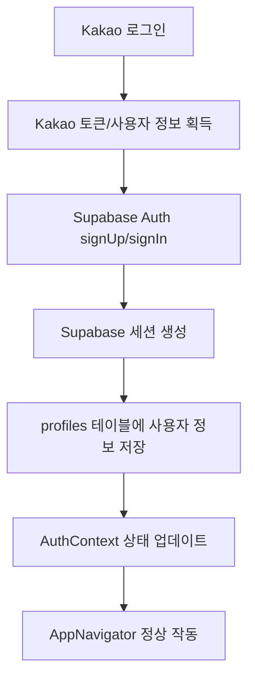

# 🚀 Kakao 로그인 + Supabase Auth 완전 연동 가이드

React Native Expo 프로젝트에서 Kakao 로그인을 Supabase Auth 세션과 완전히 연동하는 솔루션입니다.

## 🎯 해결하는 문제들

- ✅ Kakao 로그인 성공 후 Supabase 세션이 생성되지 않는 문제
- ✅ PGRST116 에러 (profiles 테이블에 row가 없음)
- ✅ AppNavigator에서 INITIAL_SESSION이 undefined인 문제
- ✅ 앱 재시작 시 로그인 상태가 유지되지 않는 문제

## 🏗️ 구현된 솔루션

### 1. 통합 인증 플로우



### 2. 주요 구현 파일들

- `lib/supabase.ts`: 카카오-Supabase 연동 로직
- `contexts/AuthContext.tsx`: 통합 인증 상태 관리
- `components/auth/LoginScreen.tsx`: 카카오 로그인 UI

## 🔧 핵심 기능들

### signInWithKakaoUser() 함수

```typescript
// lib/supabase.ts
export const signInWithKakaoUser = async (kakaoUser: any) => {
  // 1. 카카오 사용자 정보를 Supabase 형식으로 변환
  const profile = mapKakaoUserToProfile(kakaoUser);
  
  // 2. 고유한 이메일 생성 (카카오 ID 기반)
  const uniqueEmail = profile.email.includes('@') 
    ? profile.email 
    : `kakao_${profile.provider_id}@temp.roomie.app`;
  
  // 3. Supabase Auth 계정 생성/로그인
  const { data, error } = await supabase.auth.signUp({
    email: uniqueEmail,
    password: tempPassword,
    options: {
      data: {
        full_name: profile.full_name,
        avatar_url: profile.avatar_url,
        provider: 'kakao',
        provider_id: profile.provider_id,
      }
    }
  });
  
  // 4. profiles 테이블에 사용자 정보 저장
  // 5. 실제 Supabase 세션 반환
}
```

### 통합 AuthContext

```typescript
// contexts/AuthContext.tsx
const loginWithKakao = async (kakaoUser: any) => {
  // 1. 카카오 사용자를 실제 Supabase Auth 사용자로 변환
  const authUser = await signInWithKakaoUser(kakaoUser);
  
  // 2. Supabase 세션 자동 생성 확인
  const { data: { session } } = await supabase.auth.getSession();
  
  // 3. 프로필 정보 가져오기
  const { data: profile } = await supabase
    .from('profiles')
    .select('*')
    .eq('id', authUser.id)
    .single();
  
  // 4. 모든 상태 업데이트 (session, user, isAuthenticated)
  setUser(userData);
  setSupabaseUser(authUser);
  setSession(session);
  setIsAuthenticated(true);
};
```

## 🧪 테스트 방법

### 1. 새 사용자 테스트
```bash
# 1. 앱 초기화
npm start

# 2. 카카오 로그인 수행
# 3. 콘솔 로그 확인:
#   - "Creating Supabase Auth session from Kakao user"
#   - "Supabase Auth session created successfully"
#   - "Kakao login successful with Supabase Auth"

# 4. Supabase 대시보드 확인:
#   - Authentication > Users에 새 사용자 생성됨
#   - Table Editor > profiles에 프로필 정보 저장됨
```

### 2. 기존 사용자 테스트
```bash
# 1. 동일한 카카오 계정으로 재로그인
# 2. 기존 Supabase 세션이 복원되는지 확인
# 3. AppNavigator에서 정상적으로 메인 앱으로 이동하는지 확인
```

### 3. 앱 재시작 테스트
```bash
# 1. 로그인 상태에서 앱 종료
# 2. 앱 재시작
# 3. 로그인 상태가 유지되고 메인 화면으로 바로 이동하는지 확인
```

## 🔍 디버깅 팁

### 1. 세션 상태 확인
```typescript
// 앱 어디서든 현재 세션 상태 확인
const checkSession = async () => {
  const { data: { session }, error } = await supabase.auth.getSession();
  console.log('Current session:', session);
  console.log('Session error:', error);
};
```

### 2. 프로필 데이터 확인
```typescript
// 프로필 테이블 직접 조회
const checkProfile = async (userId: string) => {
  const { data, error } = await supabase
    .from('profiles')
    .select('*')
    .eq('id', userId);
  console.log('Profile data:', data);
  console.log('Profile error:', error);
};
```

### 3. 인증 이벤트 모니터링
```typescript
// AuthContext에서 이미 구현됨
supabase.auth.onAuthStateChange((event, session) => {
  console.log('Auth event:', event);
  console.log('Session:', session?.user?.id);
});
```

## ⚠️ 주의사항

### 1. 데이터베이스 스키마
```sql
-- profiles 테이블에 반드시 필요한 컬럼들
ALTER TABLE profiles ADD COLUMN IF NOT EXISTS provider TEXT DEFAULT 'email';
ALTER TABLE profiles ADD COLUMN IF NOT EXISTS provider_id TEXT;
```

### 2. 환경 설정
```env
# .env 파일에 실제 Supabase 정보 설정 필수
EXPO_PUBLIC_SUPABASE_URL=https://your-project.supabase.co
EXPO_PUBLIC_SUPABASE_ANON_KEY=your-anon-key
```

### 3. 이메일 확인 비활성화
- Supabase 대시보드 > Authentication > Settings에서
- "Enable email confirmations" 비활성화 권장 (소셜 로그인용)

## 🎉 완료 체크리스트

- [ ] 카카오 로그인 성공 시 Supabase Auth 세션 생성됨
- [ ] profiles 테이블에 사용자 정보 자동 저장됨
- [ ] AppNavigator에서 INITIAL_SESSION이 올바르게 설정됨
- [ ] 앱 재시작 시 로그인 상태 유지됨
- [ ] PGRST116 에러가 발생하지 않음
- [ ] 기존 사용자 재로그인 시 정상 작동함

이제 Kakao 로그인과 Supabase Auth가 완전히 연동되어 작동합니다! 🚀

## 📝 문제 해결

### 자주 발생하는 에러들

1. **"User already registered"**
   - 정상적인 동작: 기존 사용자 로그인으로 전환됨

2. **"Invalid login credentials"**
   - 임시 비밀번호 문제: 새 이메일로 계정 재생성됨

3. **"column does not exist"**
   - 데이터베이스 스키마 문제: `SUPABASE_MIGRATION_KAKAO.sql` 실행 필요

4. **세션이 undefined**
   - `supabase.auth.getSession()` 호출 타이밍 문제: AuthContext가 자동 처리함