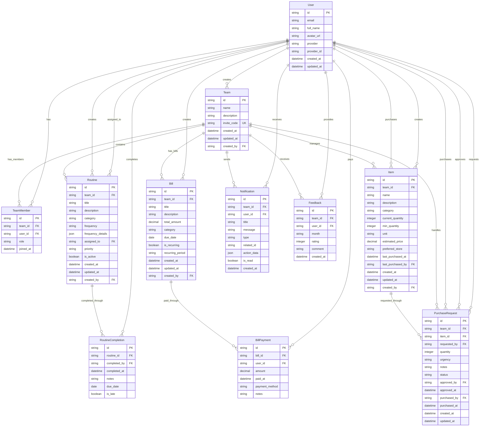

# Roomie 앱 ERD (Entity Relationship Diagram)

## 엔티티별 주요 특징

### 핵심 엔티티
1. **User** (사용자) - 앱의 기본 사용자 정보
2. **Team** (팀) - 룸메이트 그룹
3. **TeamMember** (팀 멤버) - 사용자와 팀의 다대다 관계

### 기능별 엔티티
1. **Routine & RoutineCompletion** - 루틴 관리 및 완료 기록
2. **Bill & BillPayment** - 공과금 관리 및 결제 추적
3. **Item & PurchaseRequest** - 생필품 관리 및 구매 요청
4. **Notification** - 알림 시스템
5. **Feedback** - 월별 피드백 시스템

### 주요 관계
- **User ↔ Team**: 다대다 관계 (TeamMember 테이블로 연결)
- **Team → Features**: 일대다 관계 (모든 기능은 팀 단위)
- **완료/결제 추적**: 각 기능별로 별도 추적 테이블 존재

## 데이터베이스 설계 원칙
- 모든 ID는 UUID 사용
- 소프트 딜리트는 별도 필드 사용하지 않음 (완전 삭제)
- 팀 단위 격리 (Row Level Security)
- 생성자 및 수정자 추적
- 타임스탬프 자동 관리